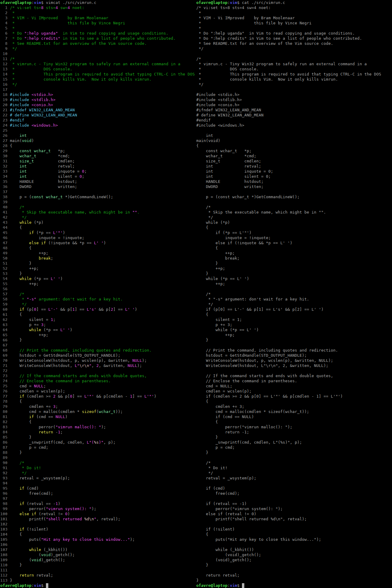

# vimcat

A supercat with Vim powers!



## Installing

Simply issue the following:

```
sudo make install
```

To uninstall, issue the following:

```
sudo make uninstall
```

Alternatively you can use the Debian packages published in the [releases section](https://github.com/ofavre/vimcat/releases).

## How does it work?

Uses a headless Vim and runs a convertion VimScript to translate the syntax highlighting into ANSI color codes, and print the file to the console to get colorized output.
This software consists solely of VimScript and bash.

The translation program is a Vim Script inspired by the `2html` plugin (see `:help :TOhtml`).

## Options

This program has many options, but you would normally use a few, if any. Use `--help` for more information.
A few options permits you to issue arbitrary Vim commands.

## Performance

Inspecting the syntax highlighting with `synID()` does not offer very good performance.
Moreover the script needs to iterates over each and every character of the file, to finds any change in coloring, and produces the corresponding color codes if any change is detected.
In 256 color modes, the parameterized strings used to output the correct color escape codes are a bit time consuming too.

On a Intel(R) Core(TM) i7-8750H CPU @ 2.20GHz, capped at that frequency, highlighting a simple C file takes 1.73 second per 1,000 lines, or 578 lines/s.
